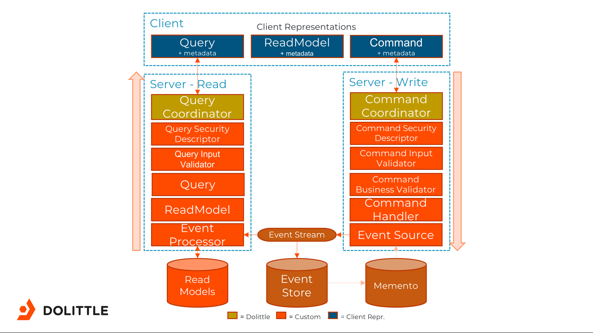

# eCommerce

## Cloning

This repository has sub modules, clone it with:

```shell
$ git clone --recursive <repository url>
```

If you've already cloned it, you can get the submodules by doing the following:

```shell
$ git submodule update --init --recursive
```

## Pre-requisites

In order for this sample to work you are going to need [.NET Core 2.1](https://www.microsoft.com/net/download) and [NodeJS](https://nodejs.org/en/) installed.

## Getting started

The sample is configured to run against a [MongoDB](https://www.mongodb.com) instance running locally, it is assuming a non-secured
instance for this. Its also assuming the default port of `27017` to connect to.

To run MongoDB as a docker image, just do:

```shell
$ docker run mongo -p 27017:27017
```

This will give you a stateless MongoDB instance - meaning that it won't keep state around between restarts.
You can of course mount a volume for state. Read more on [MongoDBs official Docker image](https://hub.docker.com/_/mongo/).

If you're running Windows, you can also run MongoDB using [Chocolatey](https://chocolatey.org).

```shell
c:\> choco install mongodb
```

To run MongoDB on Windows after installing it with `Chocolatey` you need to create a data directory, the default is `c:\data\db'.
Once this is done you can simply run the MongoDB daemon, which should be located in `c:\Program Files\MongoDB\Server\X.X\bin\mongod.exe`,
where X.X is the version e.g. **3.6**.

Once the database server is running you can use tools like [MongoDB Compass](https://www.mongodb.com/products/compass) or [Studio 3T](https://studio3t.com)
to connect to the server and verify everything is running.

Read more about the package [here](https://chocolatey.org/packages/mongodb).

### Node Packages

The Web solution is built on top of NodeJS tooling and requires all the packages to be installed. For every bounded context with a Web frontend,
you'll find a `Web` folder - this needs to have the packages in place in order to build.

For every bounded context, simply go and do the following:

```shell
$ npm install
```

or if you have [Yarn](https://www.npmjs.com/package/yarn) installed, you can simply do:

```shell
$ yarn
```

Or use the convenience script for doing it:

### Linux / macOS

```shell
$ ./install.sh
```

### Windows

```shell
c:\> install.cmd
```

There are multiple bounded contexts, as described later, that can be both run individually or together.
By default, both bounded contexts are configured to assume that the other is running.

To run a bounded context for development purposes with a watcher, you can simply run the `run.js` script in
each bounded contexts `Web` folder. This will build and start the solution and watch for any changes and
rebuild when files change.

To just get started running them, run the script in the root of this repository to get started.

### Linux / macOS

```shell
$ ./run.sh
```

### Windows

```shell
c:\> run.cmd
```

This will run the bounded contexts as background executables. You can easily run them individually as foreground
tasks as well, for each bounded context in seperate terminal windows:

```shell
$ cd Source/{bounded context}/Web
$ dotnet run
```

The event horizon system will by default connect them together and be relentless about getting a connection.
If you want to work purely on one bounded context at a time, you can either edit the `event-horizons.json` file
located in the `.dolittle` folder of the `Web` folder for each bounded context and just remove any bounded contexts
its connecting to.

For instance, take this:

```json
{
    "eventHorizons": [
        {
            "application": "0d577eb8-a70b-4e38-aca8-f85b3166bdc2",
            "boundedContext": "915b1a57-7eca-4e64-88b4-6329accd86a0",
            "url": "localhost:50054",
            "events": []
        }
    ]
}
```

And turn it into this:

```json
{
    "eventHorizons": [
    ]
}
```

Alternatively, you can just rename the `event-horizons.json` file or just delete it. This file is typically a file
that should be generated before runtime based on metadata.

## What is it built up of?

Every C# project in the solution is referencing the `Dolittle.SDK` package in the `.csproj` file:

```xml
<PackageReference Include="Dolittle.SDK" Version="2.0.0-alpha2*" />
```

This will give you the API surface needed to develop, such as `Commands`, `Events`, `CommandInputValidator`, `AggregateRoot`
and more.

Every bounded context has the same basic structure in the form of isolated projects with specific purposes, these are:

| Project | Description |
| ------- | ----------- |
| Concepts | Contains everything related to domain concepts, typically encapsulated value types and actual value objects |
| Domain | Contains the representation of commands, validation, business rules and aggregate roots / event sources |
| Events | Contains all the events in a bounded context - 

### Concepts

This is where you keep 

### Domain

### Events

### Read

### Web


## Structure

```
+-- Bounded Context 1
|   +-- Module 1
|   +---- Feature 1
|   |     | View.html
|   |     | ViewModel.js
|   |     | Styles.css
|   |     | SomeRestAPI.cs
|   |     | SomeSignalRHub.cs
|   +---- Feature 2
|   |     | View.html
|   |     | ViewModel.js
|   |     | Styles.css
|   |     | SomeRestAPI.cs
|   |     | SomeSignalRHub.cs
+-- Bounded Context 2
...
```

## 

## Application

This application is a very simple sample eCommerce solution. Its purpose is to drive out how you can leverage Dolittle to build
applications, showcasing all aspects of the frameworks and the platform as a whole. An important aspect is to give an insight into
what the different building blocks are, and how they work.

### Bounded Context: Shop

### Bounded Context: Warehouse

## Architecture



### Event Horizon


